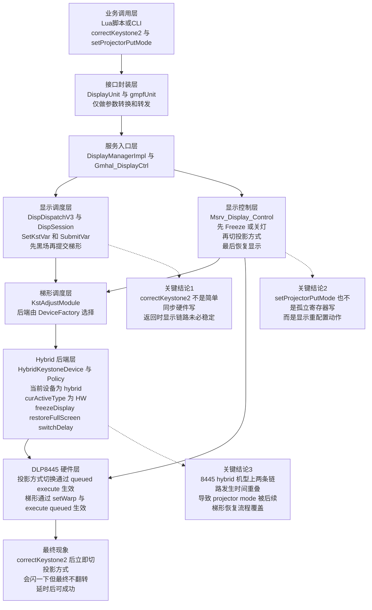
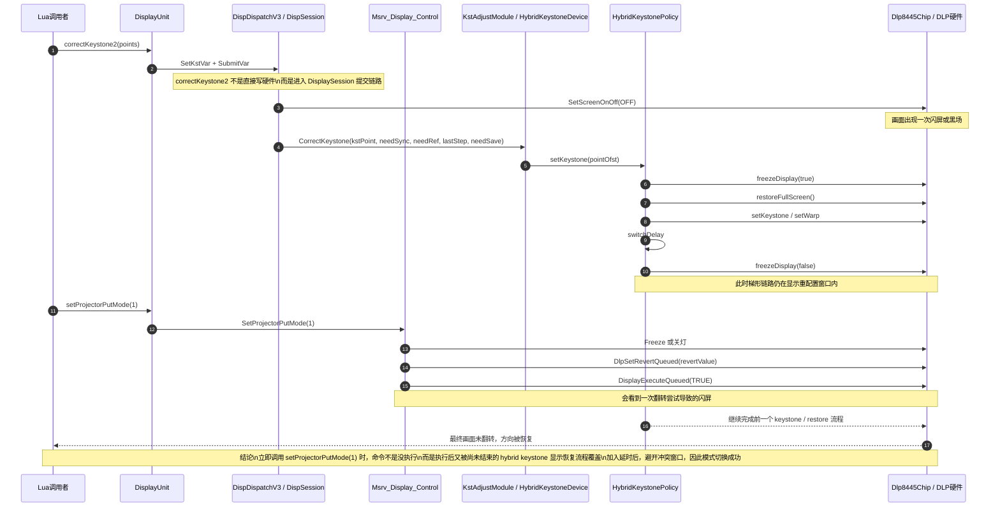

# 8445 Keystone 与 Projector Mode 分析图

## 图 1：调用架构图

图 1 注释：

该图用于说明问题并非出现在 Lua 单层封装，而是跨越接口封装层、显示调度层、显示控制层、Keystone 后端层和 DLP8445 硬件层的完整显示重配置链路。correctKeystone2 会先进入 DisplaySession 的变量提交与黑场流程，再进入 hybrid keystone 后端；setProjectorPutMode 也并非孤立寄存器写，而是会经过 Freeze 或关灯、KST 侧投影方式同步、DLP queued execute 等动作。因此，这两个调用在 8445 hybrid 机型上存在天然的时序竞争条件。

## 图 2：时序冲突图

图 2 注释：

该图用于说明现场现象“画面闪一下但投影方式不变”的直接原因。correctKeystone2 返回后，hybrid keystone 链路仍可能处在 freezeDisplay、restoreFullScreen、setWarp、switchDelay、unfreeze 的显示切换窗口内。此时立即调用 setProjectorPutMode(1)，虽然 DLP8445 的 DlpSetRevertQueued 与 DisplayExecuteQueued(TRUE) 已经执行，因此会表现为一次明显的闪屏或翻转尝试，但随后前一个 keystone 恢复流程继续完成，最终把显示状态重新拉回，导致投影方向没有稳定改变。加入延时后，实质上是等待前一条链路完成，避开冲突窗口，所以模式切换可以生效。

## 一页式汇报摘要

### 问题现象

在 DLP8445 设备上，通过 Lua 调用 correctKeystone2 后，立即调用 setProjectorPutMode(1)，现场表现为“画面会闪一下，但投影方式不变”；若中间加入约 0.5 秒延时，则投影方式切换可以稳定生效。

### 设备与链路结论

结合 gmpfUnit info 现场 dump 与源代码分析，可以确认该设备的 keystone 架构为 hybrid，而非纯 DLP_COMBINED。现场 dump 同时出现 DeviceMtkOpt 与 DeviceDlpc8445Opt，且 curActiveType = HW，说明当前 keystone 运行在 hybrid 的硬梯活动态。

### 根因分析

1. correctKeystone2 并不是同步立即完成的硬件写，而是先进入 DispDispatchV3 / DispSession 的提交链路，包含黑场与后续显示参数提交。
2. 之后 correctKeystone2 会进入 KstAdjustModule，再进入 HybridKeystoneDevice / HybridKeystonePolicy，在该链路中还会继续执行 freezeDisplay、restoreFullScreen、setKeystone 或 setWarp、switchDelay、unfreeze 等显示重配置动作。
3. setProjectorPutMode(1) 本身也不是简单单寄存器操作，而是先经过 Msrv_Display_Control 的 Freeze 或关灯，再调用 KST 侧 setProjectorPutMode 和 DLP8445 的 DlpSetRevertQueued + DisplayExecuteQueued(TRUE)，最后再恢复显示。
4. 因此，在 correctKeystone2 后立即调用 setProjectorPutMode(1) 时，两条显示重配置链路在时间上发生重叠。setProjectorPutMode 的执行并非失败，而是在执行后又被尚未完成的 hybrid keystone 恢复流程覆盖。

### 现象解释

“闪一下”说明 setProjectorPutMode(1) 确实已经进入 DLP 显示执行阶段；“最终未翻转”说明后续 hybrid keystone 显示恢复流程继续执行，并将最终显示状态重新拉回。加入延时后，等价于等待 hybrid keystone 链路先结束，因此投影方式切换能够稳定生效。

### 结论

该问题的本质不是 Lua 接口问题，也不是 8445 projector mode 枚举映射错误，而是 8445 hybrid keystone 架构下的显示重配置时序冲突问题。

### 建议方案

短期规避方案：
在 correctKeystone2 与 setProjectorPutMode(1) 之间增加经过实测验证的最小稳定延时，确保避开 hybrid keystone 的显示恢复窗口。

中期优化方案：
在业务层增加 keystone 完成通知或状态确认，在确认 correctKeystone2 对应的显示提交与后端恢复动作完成后，再触发 setProjectorPutMode。

长期修复方案：
从架构上将 keystone 与 projector mode 的显示重配置纳入同一事务或明确的顺序控制中，避免两条显示链路在 8445 hybrid 平台上互相覆盖。